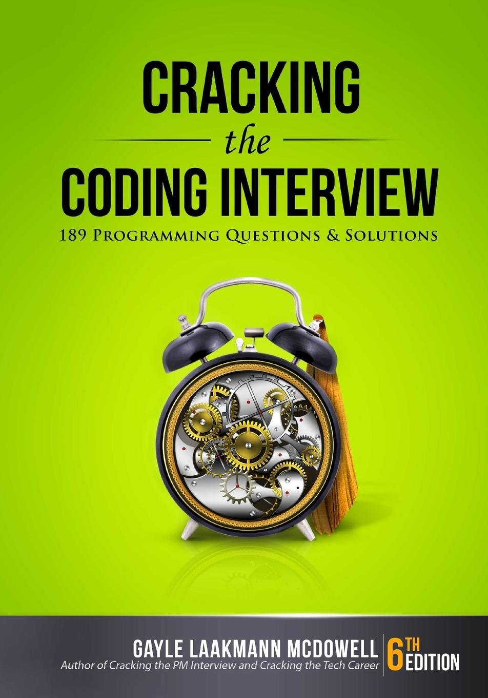

  <h1>
    Cracking the Coding Interview in JavaScript
  </h1>

  

## Intro

As a software developer, to be honest, I don't think mastering algorithm details or capable of coding in a white board matters that much. Engineers are supposed to stand on the shoulders of giants. We know what weapons we have and we wisely choose what to use. We don't have to know how to manufacture them.

However, we all have to do something we don't like. This is the cruel truth of life. Sometimes we have to be what others want us to be. So, here comes this repo. I am gonna solve all the questions in this book and write the process.

## Run Tests

`yarn test -g [grep]`.

## Chapter 1 - Arrays and Strings

### 1.1 Is Unique

> Implement an algorithm to determine if a string has all unique characters. What if you can't use additional data structures?

Need to pay attention to string encoding, js can't handle non-BMP unicode strings out of the box.

- O(N): Use a Set
- O(NLogN): Sort and one traversal

### 1.2 Check Permutation

Like always, we need to pay attention to encoding when we handle strings.

> Given two strings, write a method to decide if one is a permutation of the other.

O(NLogN): First check lengths of strings, if equal, sort and compare
O(N): First check lengths of strings, then compare the character counts

### 1.3 URLify

> Write a method to replace all spaces in a string with '%20'

O(N): Juse use an regexp.

### 1.4 Palindrome Permuatation

> Given a string, write a function to check if it is a permutation of a palindrome.

O(N): Count characters, there should be no odd or only one odd count of characters.

### 1.5 One Away

> There are three types of edits that can be performed on strings: insert a character, remove a character or replace a character. Given two strings, write a function to check if they are one edit (or zero edits) away.

O(min(Length)): First, we compare the lengths. Then iterate the short string and compare characters.

### 1.6 String Compression

> Implement a method to perform basic string compression using the counts of repeated characters. For example, the string `aabcccccaaa` would become `a2b1c5a3`. If the compressed string would not become smaller than the original string, the method should return the original string. You can assume the string has only uppercase and lowercase letters.

O(N): Just one traversal

### 1.7 Rotate Matrix

> Given an image represented by an NxN matrix, where each pixel in the image is 4 bytes, write a method to rotate this image by 90 degress. Can you do this in place?

O(N^2): Go through the matrix diagonally. For each item, calculate the next position and move it.

### 1.8 Zero Matrix

> Write an algorithm such that if an element in a MxN matrix is 0, its entire row and column are set to 0.

O(NxM): Two traversals. First we mark, then we zero out.

### 1.9 String Rotation

> Assume you have a method isSubstring which checks if one string is a substring of another. Given two strings, s1 and s2, write code to check if s2 is a rotation of s1 using only one call to isSubstring(e.g., 'waterbottle' is a rotation of 'erbottlewat').

O(N): If s2 is a rotation of s1, it must be a substring if s1+s1.

## Chapter 2 - Linked Lists

### 2.1 Remove Dups

> Write code to remove duplicates from an unsorted linked list. How would you solve this problem if a temporary buffer is not allowed?

O(N): Use a Set and one traversal
O(N^2): For each node, check remaining nodes for duplication

### 2.2 Return Kth to Last

> Implement an algorithm to find the kth to last element of a singly linked list.

If we know the size of the linked list, then this problem is too trivial to be a test. So we can be sure that we don't know the size.

We defined k such that passing k = 1 would return the last element, k = 2 would return the second to last element, and so on.

O(N): One traversal with recursive
O(N): One traversal with two pointers

### 2.3 Delete Middle Node

> Implement an algorithm to delete a node in the middle (i.e., any node but the first and the last node, not necessarily the exact middle) of a singly linked list, given only access to that node.

O(1): The only thing we can do is to copy the data from the next node to the current node and then to free the next node.

### 2.4 Partition

> Write code to partition a linked list around a value x, such that all nodes less than x come before all nodes greater than or equal to x. If x is contained within the list, the values of x only need to be after the elements less than x. The partition element x can appear anywhere in the "right partition"; it does not need to appear between the left and right partitions.

O(N): One time traversal, store nodes in two seperate arrays, one for less than x, one for greater than or equal to x. Then merge two arrays and modify `next` pointer.

### 2.5 Sum Lists

> You have two numbers representd by a linked list, where each node contains a single digit. The digits are stored in reverse order, such that the 1's digit is at the head of the list. Write a function taht adds the two numbers and returns the sum as a linked list.
> Suppose the digits are stored in forward order. Repeat the above problem.

Reverse Order, O(Max Length): One time traversal, recursively add digits

Forward Order, O(Max Length): First we need to pad short list with 0s, then recursively add digits

### 2.6 Palindrome

> Implement a function to check if a linked list is a palindrome.

O(N): Use a stack and fast runner / slow runner technique. At each step, push the data from the slow runner onto the stack. When the fast runner hits the end end of the list, the slow runner will be at the middle of the linked list. Then we can compare the value poped from the stack with value in the other half.

### 2.7 Interesction

> Given two singly linked lists, determine if the two lists interest. Return the intersecting node. Note that the intersection is defined based on reference, not value.

O(M + N): First we traverse two lists to get their lengths. There is a simple fact: if there is intersection, then the tail node of two lists must be same.

### 2.8 Loop Detection

> Given a circular linked list, implement an algorithm that returns the node at the beginning of the loop.

O(N): Use a set. This will cost us O(N) additional space.
O(N): Two pointers technique. We use a slow pointer and a fast pointer. Move slow pointer one step at a time and fast pointer two steps at a time. They must collide at a node. We say the "non-looped" part of the list has length m. We can be sure that both the collision point and the head are m steps from the loop start.

## Chapter 3 - Stacks and Queues

### 3.1 Three in One

> Describe how you could use a single array to implement three stacks.

Simple version: If we don't consider maximum the flexibility, that is if one stack is one of space we should make it grow and make others shrink. Then we can just divide the space and create three stacks. It's trivial.

Complex version: Dynamically adjust the size of stack. This clearly needs more code but is not that complicated.

